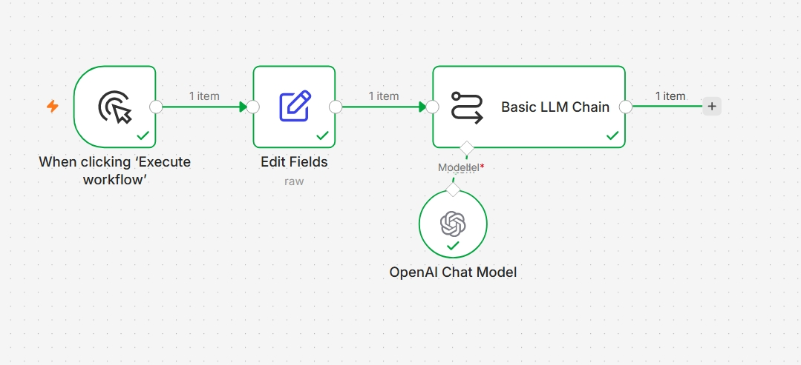
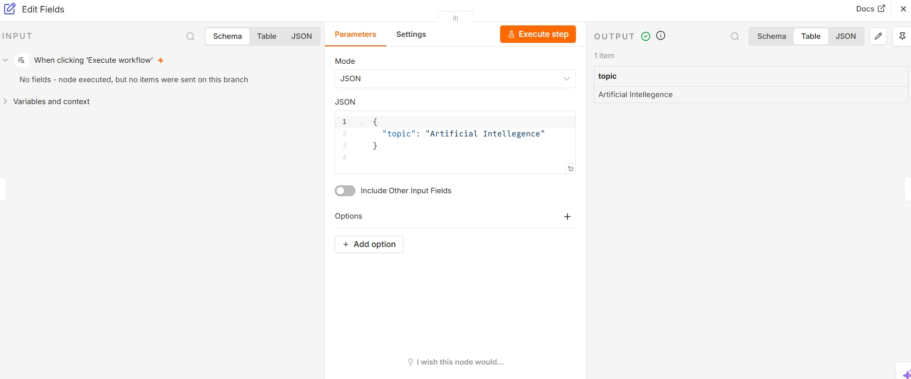
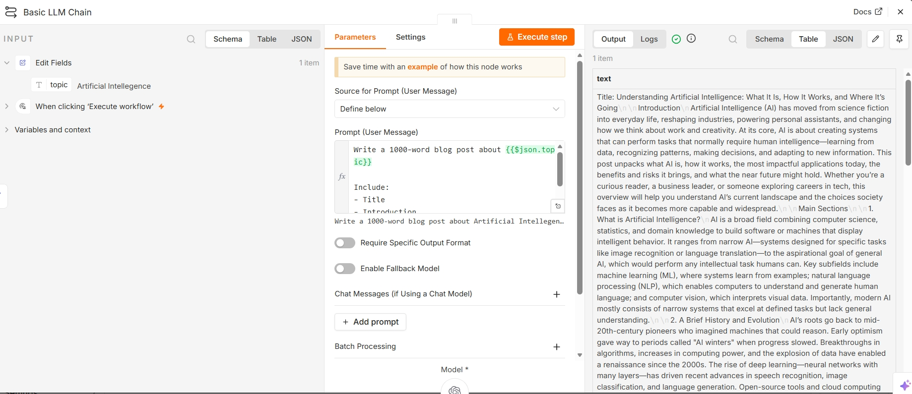

# AI Blog Generator with n8n & OpenAI

## Overview

This project automatically generates SEO-friendly blog posts using n8n and OpenAI.

The user provides a topic, and the workflow generates:

* Blog title
* Introduction
* Main content sections
* Conclusion

## Workflow

Manual Trigger → Set Topic → Basic LLM Chain → OpenAI Chat Model

## Example Input

Artificial Intelligence

## Example Output

A complete 1000-word blog article.

## Technologies Used

* n8n
* OpenAI Chat Model
* Basic LLM Chain

## Screenshots

## Workflow

## Input

## Output

## Future Improvements

* Form-based input
* Google Docs export
* WordPress publishing
* Multi-language support
